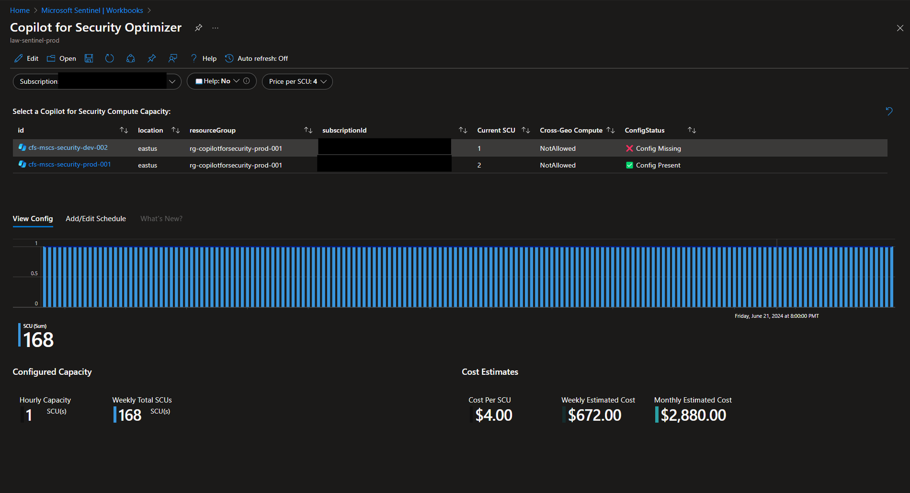
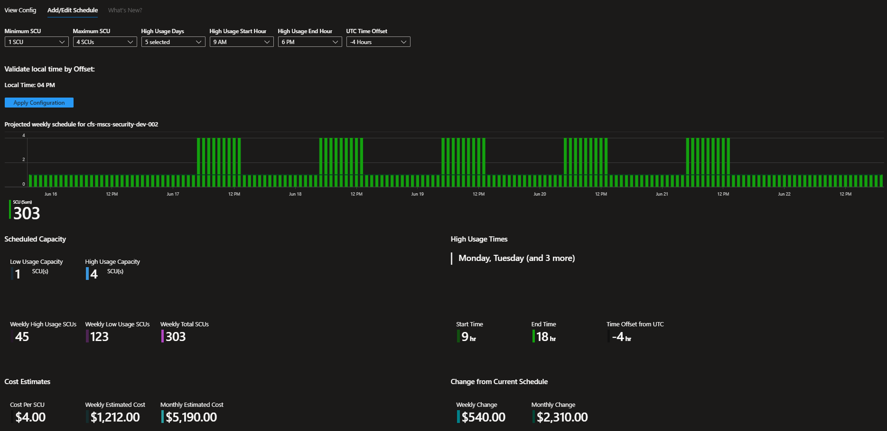
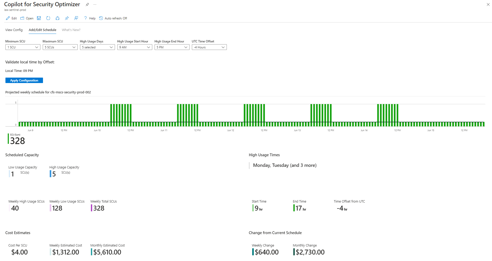
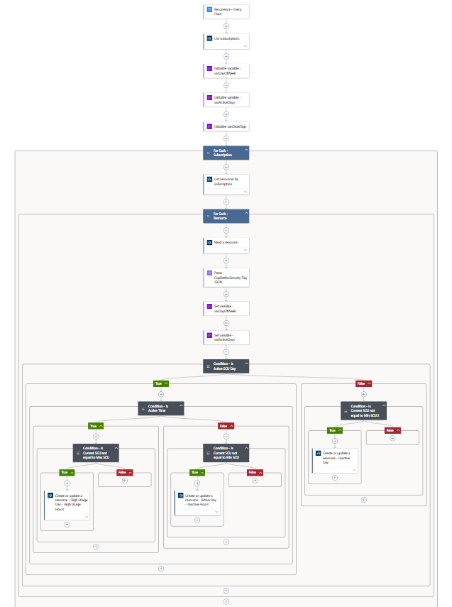

# CopilotforSecurity-Optimizer
Author: Lachlan Watson

This solution will allow you to view and control the Copilot for Security Compute Capacity SCUs based on a schedule.<br>
The solution is created using 2 core components:
- Sentinel Workbook - Copilot for Security Optimizer
- Playbook (Logic App) - Copilot for Security Scaler

In the event of a SOC operating in a more limited capacity than 24x7 such as 8x5 this can mean significant cost savings by allowing the playbook to scale the compute capacity according to the schedule that has been applied while still taking advantage of the robust capabilities from Copilot for Security.<br>


The Copilot for Security Optimizer Sentinel solution offers 3 core features:<br>

1. View - Security teams can view existing scheduling (or lack there of) on a Compute Capacity, and displays predicted costs of the solution

2. Modify - Security architects can add/modify existing schedules, view cost calculations based on the new schedule, and compare it with the existing config. This is achieved by applying a Resource Tag called: **CopilotforSecurityConfig**.

3. Apply - Finally, the Playbook/LogicApp runs hourly (5 minutes after the hour, to avoid conflict with other automations), to find resources with the CopilotforSecurityConfig tag applied, then for each compute capacity evaluates high usage schedule configuration to determine the correct SCU count, then applies if any changes need to be made.

The CopilotforSecurityConfig tag holds the information required by the Playbook to apply separate configs across multiple compute capacities.

Here is the structure of the Resource Tag:

```json
    {
    "SCULimits": {
            "Min": 1, "Max": 3
        },
        "Schedule": {
            "ActiveDays": [
                "1", "2", "3", "4"
            ],
            "ActiveStartHour": 8,
            "ActiveEndHour": 18,
            "TimeOffset": -5
        }
    }
``` 
Property definitions:
- SCULimits
    - Min: SCU count applied for Low Usage days/times
    - Max: SCU count applied for High Usage days/times
- Schedule
    - ActiveDays: interger representations of days of the week:
        - 0 = Sunday
        - 1 = Monday
        - 2 = Tuesday
        - 3 = Wednesday
        - 4 = Thursday
        - 5 = Friday
        - 6 = Saturday
    - ActiveStartHour: for high usage days, time when Maximum SCU count should be applied
    - ActiveEndHour: for high usage days, time when Minimum SCU count should be applied
    - TimeOffset: Hour offset from UTC. This is leveraged to ensure CfS is operating in the desired local time, and is paired with the workbook to validate offset to local comparison.

[Learn more about Copilot for Security](https://learn.microsoft.com/en-us/copilot/security/microsoft-security-copilot)<br>
[Learn more about Playbooks (Logic Apps)](https://learn.microsoft.com/en-us/azure/logic-apps/logic-apps-overview)<br>
[Learn more about Workbooks](https://learn.microsoft.com/en-us/azure/azure-monitor/visualize/workbooks-overview)<br>

## Prerequisites
Ideally you already have a Copilot for Security Compute Capacity deployed, if not you should considering deploying a compute capacity in the near future, as all capabilities of this solution rely on having a compute capacity already deployed.

Least-privilege resource deployment requires:
- Workbook - Monitoring Contributor
- Playbook - Logic App Contributor

Post-config requirements:
Subscription Owner is required to create and apply a least-privilege custom role for the Playbook. You may choose to assign the Contributor role if you do not want to use a custom role.<br>

## Deployment
**Deploy Solution**

[](https://portal.azure.com/#create/Microsoft.Template/uri/https%3A%2F%2Fraw.githubusercontent.com%2FLSLWatson%2FCopilotForSecurity%2Fmain%2FCopilot_For_Security_Optimizer%2Fsolution%2Fazuredeploy.json)


## Post-deployment
1. (Optional) Deploy the Copilot for Security Capacity Creator role to each subscription where Copilot for Security Compute Capacities are present for a least-privilege approach<br>
[](https://portal.azure.com/#create/Microsoft.Template/uri/https%3A%2F%2Fraw.githubusercontent.com%2FLSLWatson%2FCopilotForSecurity%2Fmain%2FCopilot_For_Security_Optimizer%2Fcustomrole%2Fazuredeploy.json)

2. Assign the Copilot for Security Capacity Creator custom role, or Contributor built-in role to the Playbook's managed identity - https://docs.microsoft.com/azure/logic-apps/create-managed-service-identity?tabs=consumption#assign-managed-identity-role-based-access-in-the-azure-portal

3. Open the playbook in the Logic App Designer and ensure connections are displaying correctly<br><br>

## Usage
**Basic usage steps:**

## Screenshots
**Workbook - View No Schedule**<br>

<br><br>
**Workbook - Apply/Modify Schedule**<br>

<br><br>
**Playbook**<br>

